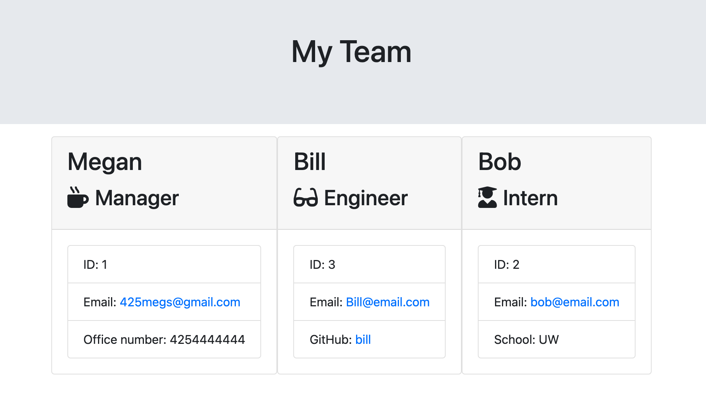

# Team Profile Generator

## User Story

AS A manager <br>
I WANT to generate a webpage that displays my team's basic info <br>
SO THAT I have quick access to their emails and GitHub profiles <br>

## Description

**Important**: When cloning, make sure that you remove `dist` from the `.gitignore` file so that Git will track this folder and include it when you push up to your application's repository.

This tool utilizes the Node.js command-line to prompt the user with questions about the employees on their team. The user will first be asked what type of employee they want to add (Manager, Engineer, Intern) and based on their selection they will be asked to input that employees data. The user will be able to run through the prompt as many times as needed to add all members of their team. Once finished, they can select 'exit' and a new HTML file will be generated containing all their employees. From there, the user can open the new file in the browser to see their team displayed. 

## Example

The following image shows a mock-up of the generated HTML’s appearance and functionality:


Video walkthrough of test passing: https://www.youtube.com/watch?v=7x08MndWtkw <br>
Video walkthrough of inputs: https://www.youtube.com/watch?v=pVbe8LDQRZw <br>
Video walkthrough of final result: https://www.youtube.com/watch?v=c0UaAxymLw4<br> 

## Technologies Used

* [Jest](https://www.npmjs.com/package/jest) for running the unit tests <br> 
* [Inquirer](https://www.npmjs.com/package/inquirer) for collecting input from the user. <br>
The application will be invoked by using the following command:
```bash
node index.js
```


---
© 2021 Trilogy Education Services, LLC, a 2U, Inc. brand. Confidential and Proprietary. All Rights Reserved.
